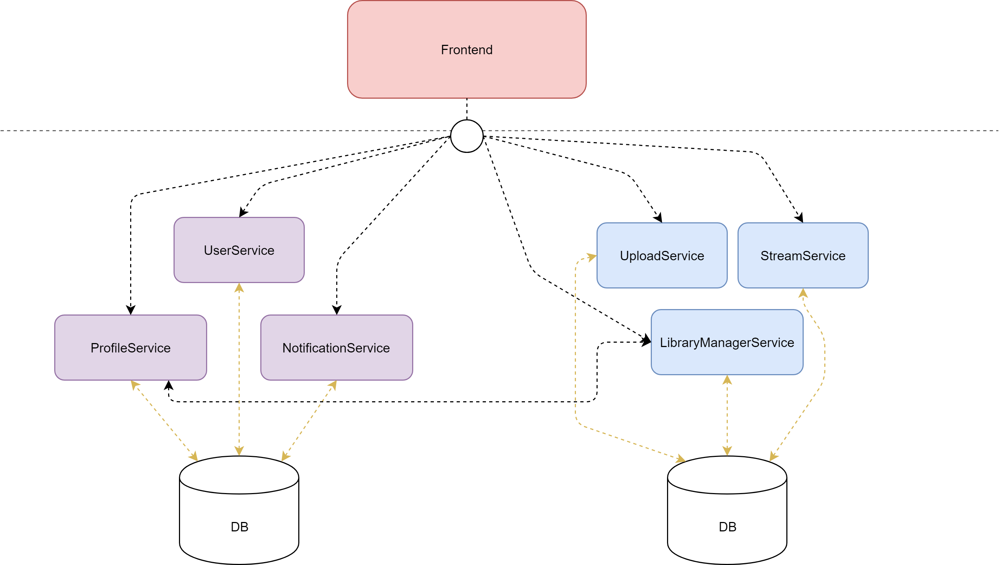

# SkipRope
Music streaming service

## Shema [(xml)](./doc/shema.xml)  

## Database (postgres)

1. Running docker image: `docker run --name skiprope-postgres -e POSTGRES_PASSWORD=skiprope --publish 5432:5432 -d postgres`

## Configuration management

1. Running consul docker image: `docker run -d --name=dev-consul --net=host consul`

## Maven project structure
Predpisana in zaželjena [struktura](https://maven.apache.org/guides/introduction/introduction-to-the-standard-directory-layout.html?fbclid=IwAR2Ix3y_8HpP4bFjVu_q2gp5_elbSmJKJgaJ9FdgfmBBvTBcwtTEsWpRtJo) maven projekta.

## Using Docker compose

Make sure you are in the same folder as `docker-compose.yaml` file.

1. Run docker compose configuration: `docker-compose up` (add `-d` flag to hide logs for each container) or `docker-compose up --build` if you need to build images
2. To stop and remove all containers/network: `docker-compose down`

If you have problems running `docker-compose up` command, check for any images related to this docker-compose and remove them by hand with `docker rmi`.

## Working with kubernetes and IBM cloud

Prerequisites:
- kubectl
- ibmcloud CLI tool (for PowerShell: `Set-ExecutionPolicy Unrestricted; iex(New-Object Net.WebClient).DownloadString('http://ibm.biz/idt-win-installer')`)

Gain access to your cluster (IBM): [Tukaj prašaj mene, ti pošljem config file]   
1. Log in to your IBM Cloud account:`ibmcloud login -a https://api.eu-de.bluemix.net`
2. Target the IBM Cloud Container Service region in which you want to work: `ibmcloud cs region-set eu-central`
3. Get the command to set the environment variable and download the Kubernetes configuration files: `ibmcloud cs cluster-config skiprope`
4. Set the KUBECONFIG environment variable. Copy the output from the previous command and paste it in your terminal. The command output should look similar to the following.
5. Verify that you can connect to your cluster by listing your worker nodes: `kubectl get nodes` (ibm more biti v nodih)

Deploy:
1. Move to location of \*.yaml file and run `kubectl create -f <deployment_file>.yaml`. 
2. See deployments: `kubectl get deployments`.

Update image:  
- `kubectl set image deployments/userservice-deployment userservice=skiprope/userservice:latest`
